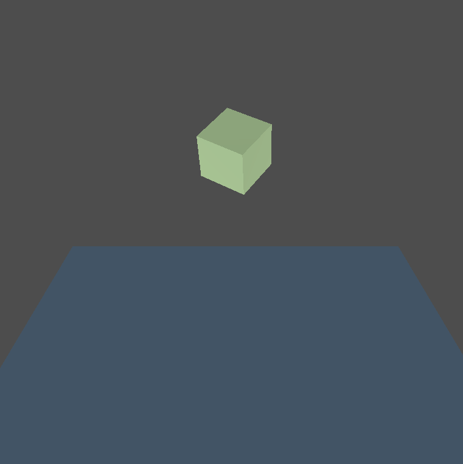

# Avian Physics Demo

This is a simple demonstration of a cube falling onto a static platform. We've
disabled Godot's built-in Physics and instead use [Jondolf/avian: ECS-driven 2D and 3D physics engine for the Bevy game engine.](https://github.com/Jondolf/avian)

So why would you choose this option and what are some of the trade-offs? You may
decide that it's easier to have all of your gameplay systems that interact with
game objects' (entities) `Transform`s in Rust using Bevy and that it's more
ergonomic to interact with physics bodies using those same Transforms. As for
downsides, this is pretty niche and hasn't been thoroughly tested, so use at
your own risk. Another is that it's actually pretty nice to use one of Godot's
built in physics engines as you get immediate access to Godot editor's built in
physics debugging capabilities, e.g., visualizing collision shapes. It should be
possible to recreate that experience using avian/godot-bevy, we just haven't
done investigated it yet. If you figure out how to do that, please consider
contributing back to this example.

> NOTE: If you decide to add this to your own project, be sure to open your
> Godot Project Settings and set your `Physics Engine` to `Dummy` (`Physics > 2D
> Physics Engine` and/or `Physics > 3D > Physics Engine`), since you definitely
> don't need two physics engines running!

Language: Rust

Renderer: Forward+

# Future work / ideas for improving this demo

There are some opportunities to improve this demo:

* Add simple collision detection/reaction
* Enable in-game helper keybindings to restart the demo, or interact with
  the bodies in more interesting ways
* Show some other physics examples, e.g., joints, raycasting, debugging, etc

## Screenshots

## Running This Example

1. **Build**: `cargo build`
2. **Run**: You can either:
    1. Open the Godot project and run the scene
    1. Run: `cargo run`. NOTE: This requires the Godot binary, which we attempt
       to locate either through your environment's path or by searching common
       locations. If this doesn't work, update your path to include Godot. If
       this fails for other reasons, it may be because your version of Godot
       is different than the one the example was built with, in that case,
       try opening the Godot project first.

This example is particularly useful for:
- Learning how to integrate [Jondolf/avian: ECS-driven 2D and 3D physics engine for the Bevy game engine.](https://github.com/Jondolf/avian)
